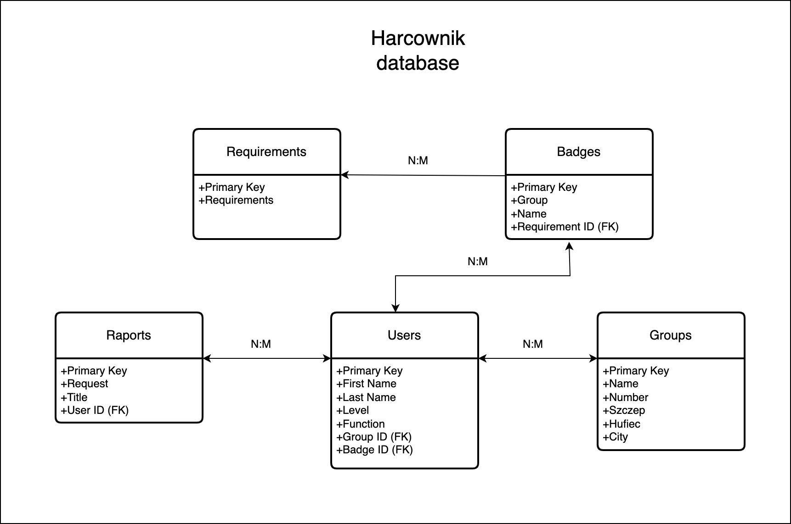

# Schemat relacyjnej bazy danych aplikacji harcownik

Baza dabych to relacyjna baza postgres.
Stawialiśmy na prostotę w celu minimalizacji kosztów na początku rozwoju startupu.
W miarę rozwoju możemy rozwijać bazę aby lepiej dostosować ją do większej ilości uytkowników

