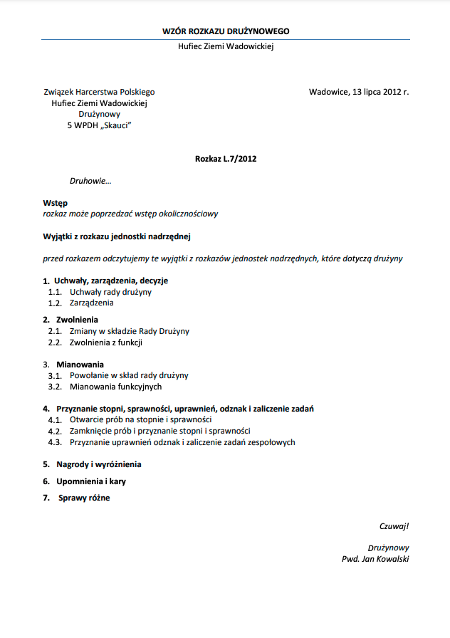

# Harcownik

## Aplikacja webowa dla harcerstwa

## Format rozkazu

## Opis w zrozumiałej formie
* na samej górze z prawej strony musi być data i miejsce
* z lewej nazwa organizacji
* na środku `Rozkaz <NUMER_ROZKAU>`
* po lewej zwrot `Druhowie...`
* wstęp jest to strzeszczenie tego co się znajduje w rozkazie, wstęp okolicznościowy
* wyjątki z rozkazu jednostki nadrzędnej
* `1. Uchawały, zarządzenia, decyzje`
  * `1.1. Uchwały, rady drużyny`
  * `1.2. Zarządzenia`
* `2. Zwolnienia`
  * `2.1. Zmiany w składzie Rady Drużyny`
  * `2.2. Zwolnienia z funkcji`
* `3. Mianowania`
  * `3.1. Powołanie w skład Rady Drużyny`
  * `3.2. Mianowanie funkcyjnych`
* `4. Przypisanie stopni, sprawności, uprawnień, odznak i zaliczenie zadań`
  * `4.1. Otwarcie prób na stopnie i sprawności`
  * `4.2. Zamknięcie prób i przyznanie stopni i sprawności`
  * `4.3. Przyznanie uprawnień odznak i zaliczenie zadań`
* `5. Nagrody i wyróżnienia` 
* `6. Upomnienia i kary`
* `7. Sprawy różne`
* na koniec po prawej stronie zwrot `Czuwaj!` i podpis np. `Drużynowa Katarzyna Duszyńska`

## Wersja podstawowa
* logowanie użytkowników (najlepiej przy użyciu kont harcerskich)
* dodawanie zgłoszeń do rozkazu, który generowany jest co miesiąc
* akceptacja rozkazu przez drużynowego
* dodawanie sprawności
* powiadomienie o składkach wysyłane na maila

## Wersja rozszeszona
* funkcja zastępowego, który może zmienic zastęp i może zmienic jego skład
* rozszerzenie aplikacji na całą polskę
* przyboczny ma te same uprawnienia co druzynowemu itd...
* stopnie (ochotnik, samerytanin, wywiadowca, odkrywca, harcerz orli, harcerz RP)
* kapituła stopni wędrowniczych -> 2 najwyższe stopnie muszą potwierdzić i naramiennik wędrowniczy
* opcje wyborów rady drużyny
* blokada na liczbę osób zastępie
  
## Zysk
Sprzedaż aplikacji jednostce jaką jest drużyna albo pójdziemy szeroko i sprzedamy to ZHP

## Konkurencja
Aktualnie brak konkurencji na rynku

## Stack technologiczny
* Backend
  * FastAPI

* Baza danych
  * PostgreSQL
  
* Frontend
  * React
  
* CI/CD
  * Github Actions
  * Github

* Infrastruktura
  * AWS/Serwer VPS (potencjalnie mikrus)

* Containers
  * Docker
  * docker compose

## Komunikacja w zespole
* Trello
* Telegram
* Microsoft Teams